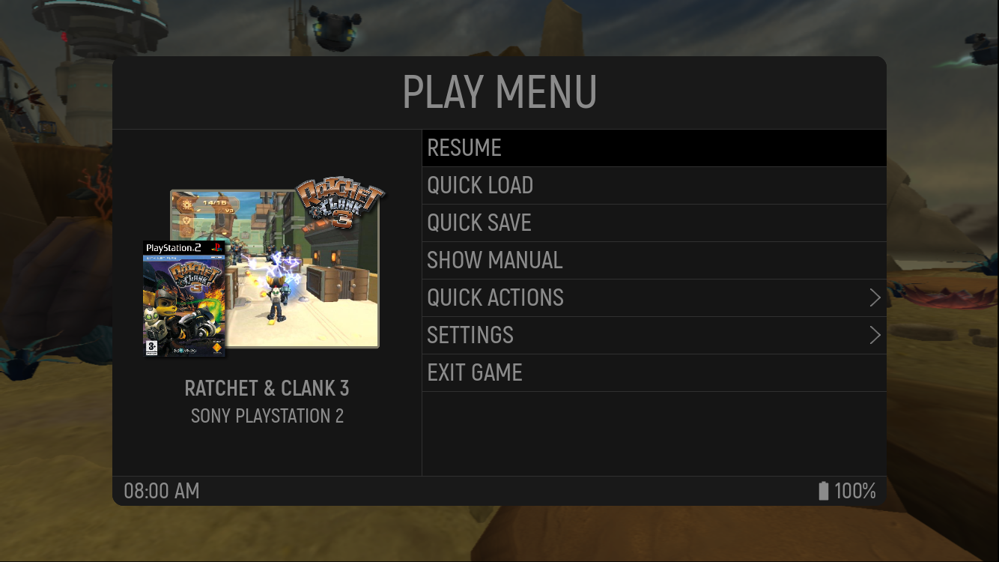
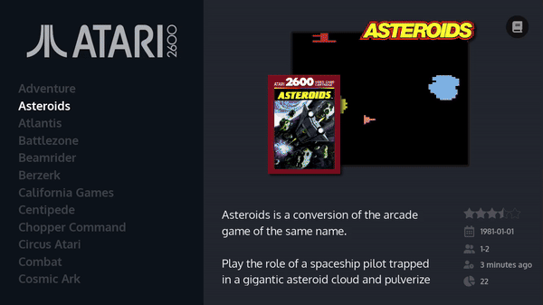
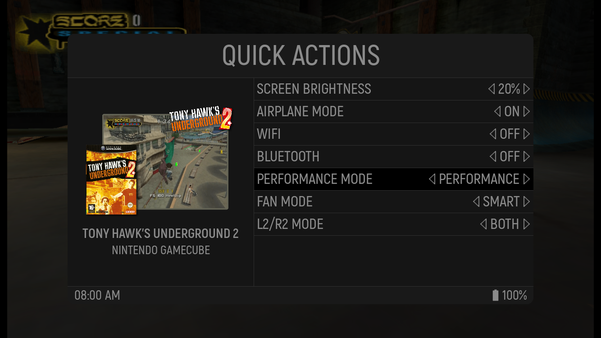
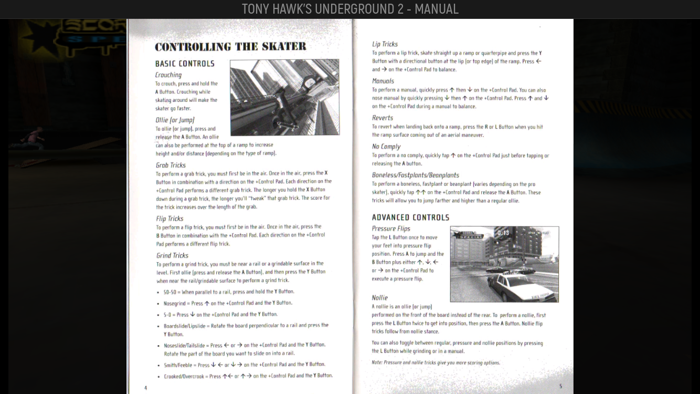

# HandheldExp
An **in game menu** for [ES-DE](https://es-de.org/) on Android.



## 📋 Features

There is **no root required**. Instead [Shizuku](https://shizuku.rikka.app/) has to be installed. The features of **HandheldExp** are currently the following:

1. **Uniform** in game menu across all emulators and apps 
2. Display of **Information** and **Game Art** of current game
3. In-Game **Manual Viewer**
4. **Quick Save** and **Quick load** for supported Emulators
5. **Automatically closing** latest emulator when returning to ES-DE
6. **Quick Actions** like changing brightness level or Airplane mode
5. **Device specific** features like changing the **Performance Mode** via menu

Below you can see **certain demonstrations** of the in game menu:

<p float="left">



</p>

## 🚀 Steps for the future

Currently **HandheldExp** is still in an early phase, and therefore there are certain features planned for the future. These are:

1. Support **Quick Save/Load** for Emulators which do **not** have **hotkey** support (e.g. Dolphin)
2. **Saving** device specific settings **per game** (e.g. Performance mode)
3. Supporting more **device specific features** for various handheld devices

## ⚙️ Installation

The following guide will demonstrate how to **install** and **setup** HandheldExp on your device.

1. It is heavily recommended to use a **physical controller** for HandheldExp
    1. Either an external one or one that is built onto the device
2. The **following apps** have to be installed
    1. [ES-DE](https://es-de.org/#Download) Android as Frontend
    2. [KeyMapper](https://play.google.com/store/apps/details?id=io.github.sds100.keymapper&hl=de) to map the opening and closing button for the Menu
    3. [Shizuku](https://play.google.com/store/apps/details?id=moe.shizuku.privileged.api) to give HandheldExp privileged permissions
3. Download the **HandhelpExp APK** from GitHub and install it on your device
4. **Setup ES-DE**
    1. Perform all the required setup steps for your emulators
    2. Scrape your Game Art and optionally your Manuals with ES-DE
    3. Enable custom scripts
        1. Go to ES-DE Menu > Other Settings > Enable custom event scripts
    4. Setup ES-DE as Home Launcher as as described [here](https://gitlab.com/es-de/emulationstation-de/-/blob/master/ANDROID.md?ref_type=heads#running-es-de-as-the-android-home-app)
5. **Setup the HandhelpExp ES-DE Scripts**
    1. Navigate to your `ES-DE` folder in Android
    2. With the scripts create the folders `game-start` and `game-end`
    3. Place file [game-start](./scripts/es-de/game-start/game_start.sh) into the `game-start` folder
    4. Place file [game-end](./scripts/es-de/game-end/game_end.sh) into the `game-end` folder
    5. Your folder structure should look like this afterwards
```
.
└── ES-DE/
    └── scripts/
        └── game-end/
            └── game_end.sh
        └── game-start/
            └── game_start.sh
```
6. **Restart ES-DE**
    1. Open the Settings App
    1. Go Apps
    2. Search for ES-DE
    3. Force close the app
    4. Close the Settings App
7. **Setup Shizuku**
    1. Follow [this guide](https://shizuku.rikka.app/guide/setup/#start-shizuku) to start Shizuku
8. **Setup KeyMapper**
    1. Open KeyMapper
    2. Follow the instructions to setup KeyMapper
    2. Click on on the Plus symbol
    3. Within the "Trigger" tab setup a key or key combination with that you would like to open and close the HandheldExp Menu
        1. Select if you want to to remap the button
        2. If you have a hardware Home Button, it is recommended to set this as menu toggle button with remapping enabled
    4. With the "Actions" tab click on "Add Trigger"
        1. Select "Send Intent"
        2. Set and description you want
        3. Select "Broadcast receiver"
        4. Enter for the Action field `com.handheld.exp.OVERLAY`
        5. Save your changes
    5. Fully close KeyMapper by swiping it away
        1. On some devices it is required everytime after closing KeyMapper to enable the accessibility service again for KeyMapper in your Settings
9. **Setup HandheldExp**
    1. Open HandheldExp
    2. Set the location of your ES-DE folder
    3. Set the location of your ES-DE media folder
        1. This is by default the folder `downloaded_media` under the ES-DE folder
    4. Grant overlay permission
    5. Grant Shizuku permission
    6. You can click the button "Open overlay menu" to test if the menu is appearing
10. **Test if everyhing works**
    1. Open a game via ES-DE
    2. Press the menu toggle button you set in Keymapper
    3. The menu should appear with the respective game information
11. **Continue with the setup of specific features**
    1. Setup of Quick Save/Load
    2. Optionally Setup of device specific features

## 💾 Setup Quick Save/Load

The following guide will demonstrate how to **setup** Quick Save/Load for HandheldExp.

1. **Quick Save** and **Quick Load** have to be setup for **every emulator** individually
2. As long as the emulator **supports hotkeys** for Quick Save/Load, HandheldExp is able to **integrate** with it
3. Currently it is **confirmed** that the following emulators **support** Quick Save/Load with HandheldExp
    1. RetroArch, DuckStation, PPSSPP, Flycast, AetherSX2/NetherSX2, Mupen64Plus, Citra PabloMK7, Mandarine, DraStic
4. The following **guide** will show how to setup Quick Save/Load for **RetroArch**
    1. For other emulators the setup follows a similar principle
    2. Open RetroArch
    3. Navigate to Settings > Input > Hotkeys
    4. Open the HandheldExp menu with the toggle button
    5. Navigate to Other Settings > Load/Save State Setup > Start Setup
    6. The menu will now only react to touch input while you can navigate in RetroArch with your controller
    7. Select in RetroArch the Load State Setting
        1. Click via touch then on "Set Quick Load" in the HandheldExp Menu
    8. Select in RetroArch the Save State Setting
        1. Click via touch then on "Set Quick Save" in the HandheldExp Menu
    9. Click on via touch on "Stop Setup"
    10. The setup for RetroArch is now done

## 🤖 Device Specific Features
HandheldExp also supports **features specifically tailored** for **certain devices**. The following **lists the devices** those extra features are supported for:
    
### 🎮 Retroid Pocket 4 Pro / Ayn Odin 2 / Ayn Odin 2 Mini
1. **Supported extra features**
    1. Performance mode selection via Menu
    2. Fan mode selection via Menu
    3. Trigger mode selection via Menu
    4. Fan and Performance mode will automatically reset when returning back to ES-DE
2. **Disclaimer**: Extra features might stop working when upgrading to a new firmare for the respective devices or behave unexpectedly

### 🎮 Other devices
1. Currently other devices do not have support for **extra features**
2. It is **planned** to add extra support for other device such as
    1. Anbernic RG556 
    2. Anbernic RG Cube
    3. Other potential Android Handhelds

<!---
## 🛠️ Building
For **building** HandheldExp yourself, the following is **required**:
1. Follow [this guide](https://developer.android.com/studio/install) to install Android Studio
2. Install Android SDK 34
3. Clone or download the project and open it in Android Studio

## 🏭 Development
1. Guide will follow
--->

## 🎖️ Acknowlegements
1. [OdinTools](https://github.com/langerhans/OdinTools) for figuring out on how to change Ayn Odin 2 **device specific settings** and gaining access to a **privileged shell executor**
2. [ES-DE GitLab project](https://gitlab.com/es-de/emulationstation-de) for certain **assets** like fonts or images


