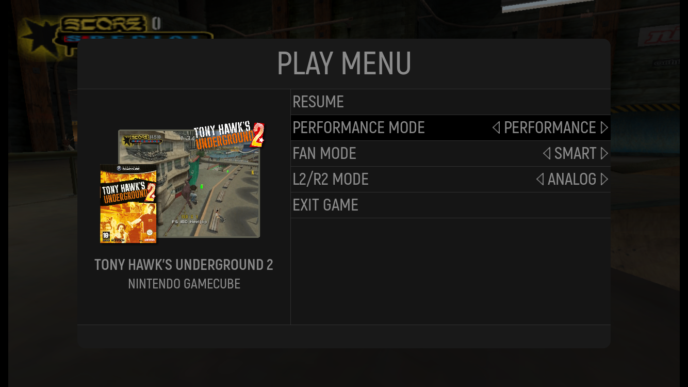

# HandheldExp
An in game menu for ES-DE on Android.

## Concept
Currently emulation frontends launch independent apps for each system which is being played.
During the emulation session there is not integration of the frontend, while the emulator provides an in game menu
which is drastically different across other emulators and towards the frontend.

Additionally on Android Emulation Handhelds performing certain actions or changing Android settings during a play session requires most of the time
touch input.

HandheldExp solves to aim these issues by providing three key aspects: 
1. Full integration with ES-DE on Android
2. Uniform in game menu across all emulators and apps 
3. Supporting the most important actions for a play session via controller input

In the end the goal is to provide a seamless handheld experience for Android as seen in the short showcase here:

## Current State
The following shows the currently supported devices and its features

### Retroid Pocket 4 Pro
Supported features
1. In game Menu opening and closing
2. Display of game title, emulator and image provided by ES-DE
3. Chaning handheld specific settings
    - Performance mode
    - Fan mode
    - L2/R2 mode
4. Improving the overall handheld experience
    - Performance mode and fan mode will automatically reset when returnig to ES-DE
    - Navigating back to ES-DE will automatically close the recently opened emulator properly

## Steps for the future
1. Supporting more Settings via the in game menu 
2. Provding a proper app exit approach which does not require simulated touch events
3. Supporting Quck Save and Quick Load for most Emulators
4. Supporting the most common Android Handhels
5. Supporting auto remembering of settings per game

## Setup
Overall the following apps will be required
1. ES-DE Android as Frontend
2. AnyHome to set ES-DE as home app
3. Keymapper to map the opening and closing button for the Menu
4. HandheldExp for the Menu itself

The full steps will be described soon

## Acknowlegements
1. OdinTools for figuring out on how to change Ayn Odin 2 device specific settings and gaining access to a privileged shell executor

